# Installation Preparation
```shell
pip3 install flight_profiler
```

This command will install flight_profiler to the current Python3 site-packages directory. After installation, you can use the global command `flight_profiler` for debugging.

# Starting Debugging
First, find the target debugging process by checking the process PID with the ps command:

```shell
ps -ef | grep python
```

Start debugging by passing the target PID as a parameter:

```shell
flight_profiler pid
```

You can then start entering debugging commands.

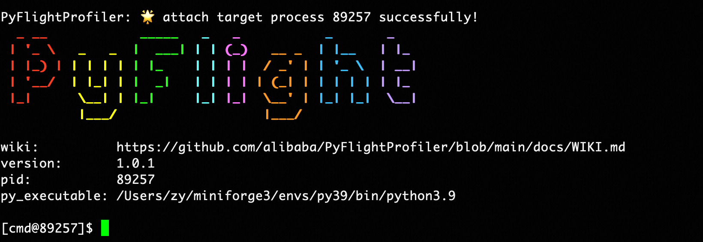

# Command Guide
## Command Description: help
View all available commands and their specific usage.

```shell
help [command]
```

### Parameter Analysis
| Parameter | Required | Meaning | Example |
| --- | --- | --- | --- |
| command | No | The command name to view | stack |

### Output Display
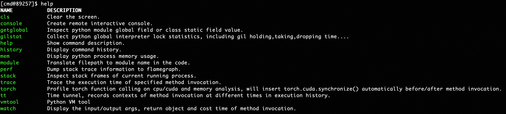

## Thread Stack Analysis: stack
### Thread Stack: stack
#### Linux Environment
View Python execution stack information for all threads currently running in the process, and support analyzing native stacks and exporting to files.

```shell
stack [pid] [-f <value>] [--native]
```

##### Parameter Analysis
| Parameter | Required | Meaning | Example |
| --- | --- | --- | --- |
| pid | No | Process ID to analyze, defaults to the injected process ID | 3303 |
| -f, --filepath | No | File path to export thread stacks to | /home/admin/stack.log |
| --native | No | Whether to analyze native stacks of Python threads, defaults to False | --native |

##### Output Display
Command examples:

```shell
# View Python thread stacks
stack

# View native stacks of Python threads
stack --native

# Export execution stack information to a file
stack -f ./stack.log
```

Executing the `stack` command will display stack information for all threads in the console.

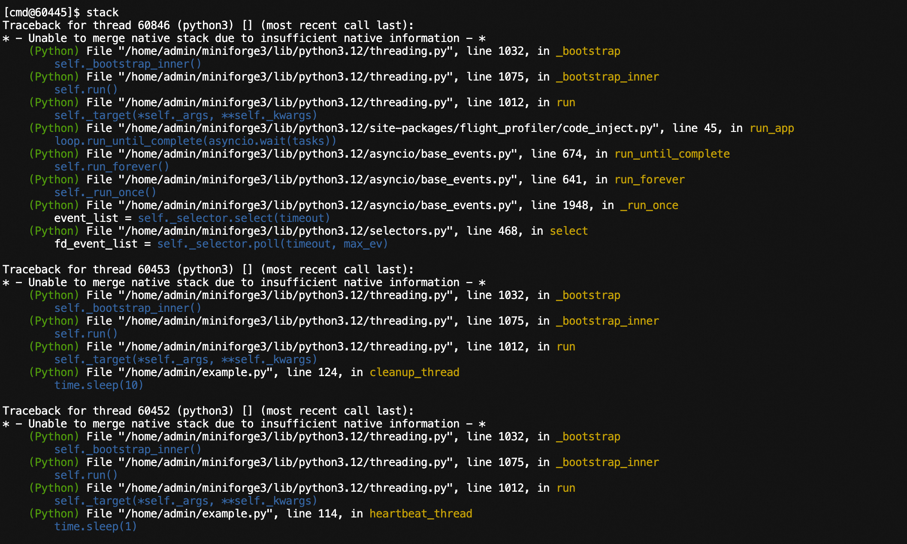

Analyzing native thread stacks:

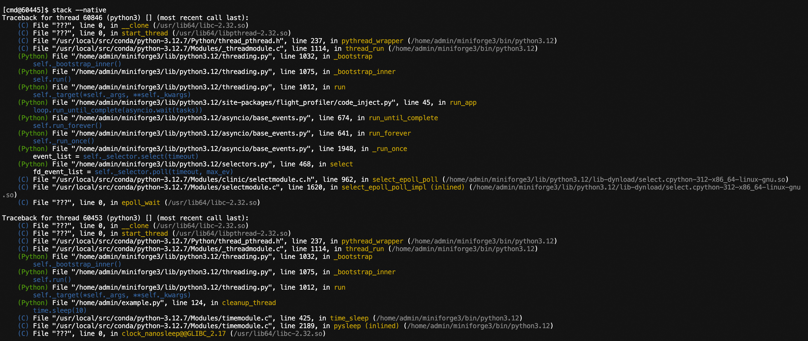

#### Mac Environment
View Python execution stack information for all threads currently running in the process, and support exporting to files.

```shell
stack [filepath]
```

##### Parameter Analysis
| Parameter | Required | Meaning | Example |
| --- | --- | --- | --- |
| filepath | No | File path to export thread stacks to | /home/admin/stack.log |

##### Output Display
Executing the `stack` command will display stack information for all threads in the console.

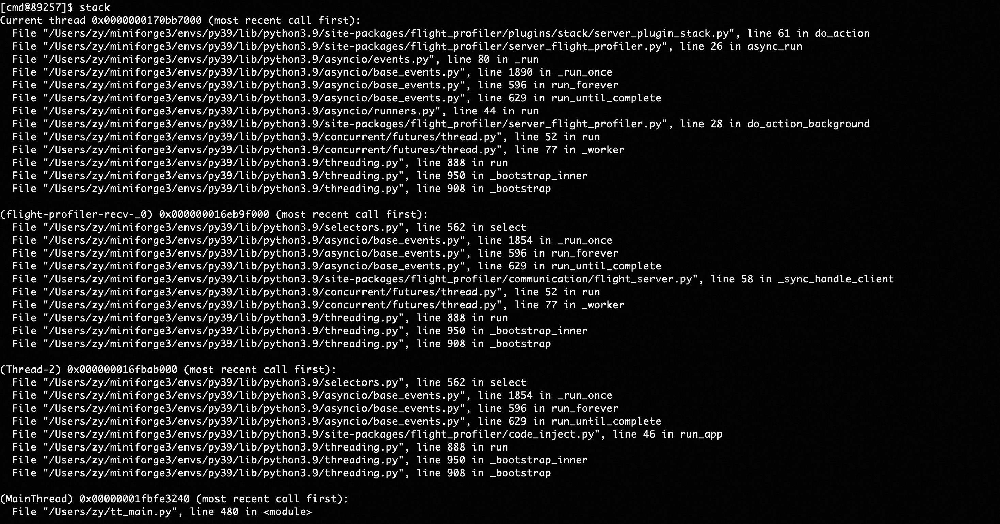


## Method Execution Observation: watch
### Observing Method Input, Output, and Time Consumption
The watch command is as follows:

```shell
watch module [class] method [--expr <value>] [-nm <value] [-e] [-r] [-v] [-n <value>] [-x <value>] [-f <value>]
```

#### Parameter Analysis
| Parameter            | Required | Meaning                                                                                                                                                                                                                                                                                                                                                                                                                                    | Example                       |
|----------------------|----------|--------------------------------------------------------------------------------------------------------------------------------------------------------------------------------------------------------------------------------------------------------------------------------------------------------------------------------------------------------------------------------------------------------------------------------------------|-------------------------------|
| module               | Yes      | Module where the method is located                                                                                                                                                                                                                                                                                                                                                                                                         | __main__, my.pkg.modulename   |
| class                | No       | Class name where the method is located                                                                                                                                                                                                                                                                                                                                                                                                     | className                     |
| method               | Yes      | Method name to observe                                                                                                                                                                                                                                                                                                                                                                                                                     | methodName                    |
| -nm, --nested-method | No       | Whether capture nested method with depth restrict to 1                                                                                                                                                                                                                                                                                                                                                                                     | -nm nested_method             |
| --expr               | No       | Expression to observe.<br/>Reference Python method parameters as (target, return_obj, cost, *args, **kwargs), where target is the class instance (if the call is a class method), return_obj is the method return object, cost is the method call time consumption, *args are non-specified parameters, and **kwargs are specified parameters. Need to return a right-value expression about these parameters.<br/>Defaults to args, kwargs | --expr args,kwargs,return_obj |
| -e                   | No       | exception, only record when method execution has an exception                                                                                                                                                                                                                                                                                                                                                                              | -e                            |
| -r, --raw            | No       | Whether to directly display the string representation of the target                                                                                                                                                                                                                                                                                                                                                                        | -r                            |
| -v, --verbose        | No       | Whether to display all sub-items of target lists/dictionaries                                                                                                                                                                                                                                                                                                                                                                              | -v                            |
| -x, --expand         | No       | expand, depth to display observed objects, defaults to 1, maximum is 4                                                                                                                                                                                                                                                                                                                                                                     | -x 2                          |
| -f, --filter         | No       | Filter parameter expression, only calls passing the filter conditions will be observed.<br/>Writing format is the same as --expr directive, needs to return a boolean expression.                                                                                                                                                                                                                                                          | -f args[0]["query"]=='hello'  |
| -n, --limits         | No       | Maximum number of observed display items, defaults to 10                                                                                                                                                                                                                                                                                                                                                                                   | -n 50                         |

**<font style="color:#DF2A3F;">Expression Notes:</font>**

1. If the expression value contains spaces, it needs to be enclosed in quotes, for example -f "args[0] == 'hello'"
2. If the observed value contains class instances, for private variables in class instances (fields starting with __), users need to explicitly modify the access method. For example, if args[0] is an instance of class A containing a __val variable, the expression should be: --expr args[0]._A__val, which adds the "_class_name" prefix before the private variable (Python convention)

#### Output Display
Command examples:

```shell
# watch module function
watch __main__ func -x 2

# watch module function and filter parameters
watch __main__ func -f "args[0][\"query\"]=='hello'"

# watch module function and filter return values
watch __main__ func -f "return_obj['success']==True"

# watch module function and filter function call time consumption
watch __main__ func --expr "{return_obj,args}" -f "cost>10"

# watch class function
watch __main__ classA func
```

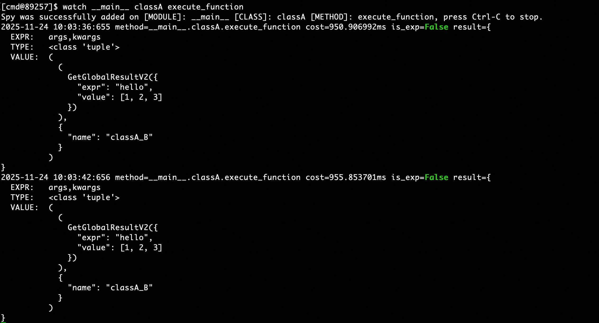

Output field information includes:

+ cost: Method execution time consumption, in milliseconds
+ result: Observation results item by item for the watch command expression
    - EXPR: Expression name, such as arg for positional parameters, kwargs for keyword parameters
    - VALUE: Expression value, such as arg expression displayed as parameter list, kwargs expression displayed as key-value pairs

## Method Internal Call Path Observation: trace
### Observing Method Execution Paths and Time Consumption
The trace command is as follows:

```shell
trace module [class] method [-i <value>] [-nm <value>] [-et <value>] [-d <value>] [-n <value>] [-f <value>]
```

#### Parameter Analysis
| Parameter            | Required | Meaning | Example                          |
|----------------------| --- | --- |----------------------------------|
| module               | Yes | Module where the method is located | __main__, my.pkg.modulename      |
| class                | No | Class name where the method is located | className                        |
| method               | Yes | Method name to observe | methodName                       |
| -nm, --nested-method | No       | Whether capture nested method with depth restrict to 1                                                                                                                                                                                                                                                                                                                                                                                     | -nm nested_method                |
| -d, --depth          | No | Display the call stack up to the specified depth. Use with -i 0 to trace the internal invocation path. | -d 3                             |
| -i, --interval       | No | Only observe internal method calls with execution time greater than #{interval}, defaults to 0.1ms. Note that the smaller #{interval} is, the greater the observation overhead on method execution. Tested overhead for simple text reasoning methods is about 10%~20% under default conditions, fluctuating with the complexity of the observed method. | -i 1                             |
| -et, --entrance_time | No | Only display method calls with execution time exceeding #{entrance_time} | -et 30                           |
| -f, --filter         | No | Filter parameter expression, only calls passing filter conditions will be observed.<br/>Reference Python method parameters as (target, *args, **kwargs), needs to return a boolean expression about target, args, and kwargs, where target is the class instance (if the call is a class method), args and kwargs are the called method's parameters | -f "args[0][\"query\"]=='hello'" |
| -n, --limits         | No | Maximum number of observed display items, defaults to 10 | -n 50                            |

#### Output Display
Command examples:

```shell
# Trace module function
trace __main__ func

# Trace module function and only trace function calls with execution time exceeding 1ms
trace __main__ func -i 1

# Trace class function
trace __main__ classA func
```

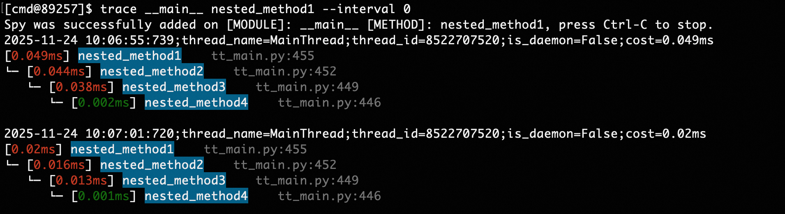

## Cross-Time Method Call Observation: tt
### Observing Method Calls Across Time Periods
The tt command is as follows:

```shell
tt [-t module [class] method] [-n <value>] [-l] [-i <value>] [-d <value>] [-da] [-x <value>] [-p] [-f <value>] [-r] [-v] [-m <value>]
```

#### Parameter Analysis:
| Parameter | Required | Meaning | Example |
| --- | --- | --- | --- |
| -t module [class] method | No | Observe method calls in the specified module over time and space, module/class/method definitions are the same as in watch/trace | -t moduleA classA func |
| -nm, --nested-method | No       | Whether capture nested method with depth restrict to 1                                                                                                                                                                                                                                                                                                                                                                                     | -nm nested_method             |
| -n, --limits <value> | No | Maximum number of observed display items, defaults to 50 | -n 50 |
| -l, --list | No | Display all method call segments | -l |
| -i, --index <value> | No | Display details of the method call corresponding to the index | -i 1000 |
| -d, --delete <value> | No | Delete the call record corresponding to the index | -d 1000 |
| -da, --delete_all | No | Delete all call records | -da |
| -r, --raw | No | Whether to directly display the string representation of the target, i.e., repr(target) | -r |
| -v, --verbose | No | Whether to display all sub-items of target lists/dictionaries | -v |
| -x, --expand | No | expand, depth to display observed objects, defaults to 1, maximum is 4 | -x 2 |
| -p, --play | No | Whether to re-trigger historical calls, used with -i, using the call parameters specified by index | -i 1000 -p |
| -f, --filter | No | Filter parameter expression, reference watch command | -f "args[0][\"query\"]=='hello'" |
| -m, --method | No | Filter method name, format is module.class.method, if the method is a class method, class is None, compatible with -l | -l -m moduleA.classA.methodA |

#### Output Display
Command examples:

```shell
# Record module method
tt -t __main__ func

# Record class method
tt -t __main__ A func

# Display called method record list
tt -l

# Display specified call details
tt -i 1000 -x 3

# Re-trigger the call with index 1000, using the same input
tt -i 1000 -p

# Only observe records with return value 'success' and time consumption greater than 10ms
tt -t __main__ func -f "return_obj['success']==True and cost>10"

# Only observe requests where the first method parameter contains a query field with value "hello"
tt -t __main__ func -f "args[0][\"query\"]=='hello'"
```

Observing method calls:

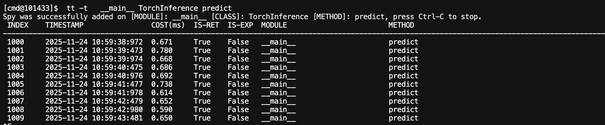

Specifying index:

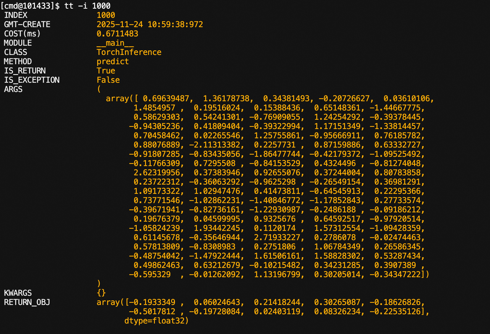

Re-executing historical calls:

It can be seen that the index has changed: 1000 -> 1010

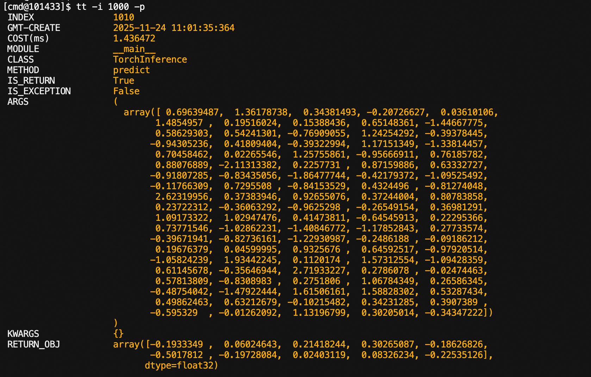

## Global Variable Viewing: getglobal
### Observing Module Global Variables/Class Static Variables
The getglobal command is as follows:

```shell
getglobal module [class] field [-x <value>] [-e <value>] [-r] [-v]
```

#### Parameter Analysis
| Parameter | Required | Meaning | Example |
| --- | --- | --- | --- |
| module | Yes | Module where the field is located | __main__, my.pkg.modulename |
| class | No | Class name where the field is located | className |
| field | Yes | Field name | fieldName |
| -e, --expr | No | Expression for observing objects, reference Python method parameters as (target), target is the observed object, needs to return a right-value expression about target. | -e target.fieldA |
| -x, --expand | No | expand, depth to display observed objects, defaults to 1, maximum is 4 | -x 2 |
| -r, --raw | No | Whether to directly display the string representation of the target | -r |
| -v, --verbose | No | Whether to display all sub-items of target lists/dictionaries | -v |

#### Output Display
For variables in python files started by __main__, use the following command:

```shell
# Module variables
getglobal __main__ g_list

# Class static variables
getglobal __main__ classA static_field
```

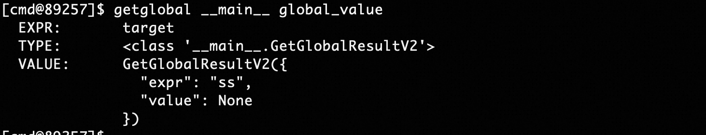

## PythonVm Tools: vmtool
### Viewing Class Instances: getInstances
Command as follows:

```shell
vmtool -a getInstances -c module class [-e <value>] [-x <value>] [-n <value>] [-v] [-r]
```

#### Parameter Analysis
| Parameter | Required | Meaning | Example |
|-----------------------| --- | --- | --- |
| module | Yes | Module where the class is located | __main__, my.pkg.modulename |
| class | Yes | Class name | className |
| -e, --expr <value> | No | Expression for observing objects, reference Python method parameters as (instances), instances is the instance list of the corresponding class, needs to return a right-value expression about instances. | -e instances[0].fieldA |
| -x, --expand <value> | No | expand, depth to display observed objects, defaults to 1, maximum is 4 | -x 2 |
| -r, --raw | No | Whether to directly display the string representation of the target | -r |
| -v, --verbose | No | Whether to display all sub-items of target lists/dictionaries | -v |
| -n, --limits <value> | No | Control the number of displayed instances, defaults to 10, -1 means no limit | -n 1|

#### Output Display
For variables in python files started by __main__, use the following command:

```shell
# View all instances of class A
vmtool -a getInstances -c __main__ A

# View variables of instances of class A
vmtool -a getInstances -c __main__ A -e instances[0].val
```

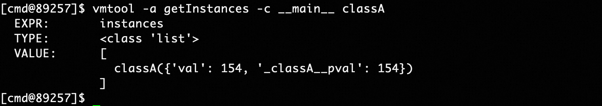

### Force Garbage Collection: forceGc
Command as follows:

```shell
vmtool -a forceGc
```

#### Output Display
```shell
vmtool -a forceGc
```

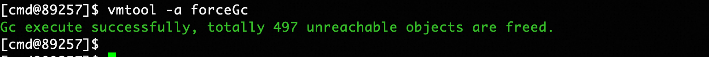

## Get File Module Name: module
This command will output the module corresponding to the filename in the injected process, facilitating users to directly locate methods or variables based on exception stacks.

The module command is as follows:

```shell
module filepath
```

### Parameter Analysis
| Parameter | Required | Meaning | Example |
| --- | --- | --- | --- |
| filepath | Yes | Filename to be escaped | /home/admin/main.py |

### Output Display
Command examples:

```shell
# Corresponding module is __main__.py
module ~/tt_main.py

# Not imported into the specified process
module ~/not_exist.py
```

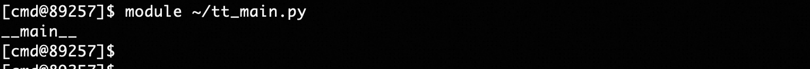

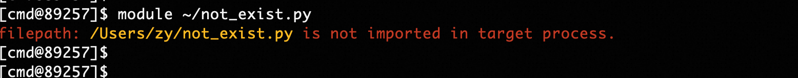

## Program Hotspot Flame Graph: Perf
Sample profile the program process to generate flame graphs, facilitating users to optimize program hotspots, implemented based on [py-spy](https://github.com/benfred/py-spy).

The perf command:

```shell
perf [pid] [-f <value>] [-r <value>] [-d <value>]
```

### Parameter Analysis
| Parameter | Required | Meaning | Example |
| --- | --- | --- | --- |
| [pid] | No | Process ID to analyze, defaults to the injected process | 123/empty |
| -f, --filepath <value> | No | Path to export flame graph, defaults to flamegraph.svg in current directory | -f ~/sample.svg |
| -r --rate <value> | No | Samples per second, defaults to 100 | -r 1000 |
| -d --duration <value> | No | Duration in seconds, defaults to waiting for user interruption | -d 30 |

### Output Display
Command examples:

```shell
perf

# Output will be exported to ~/flamegraph.svg
perf -f ~/flamegraph.svg

# Sample for 30s
perf -d 30 -f ~/flamegraph.svg
```

<font style="color:#DF2A3F;">Using this command on MacOS requires root permissions for py-spy</font>


## Enable Interactive Console
Enable interactive console in the specified process, supporting users to execute custom scripts, get system properties, and other operations.

The console command:

```shell
console
```

### Output Display
Command examples:

```shell
console
```

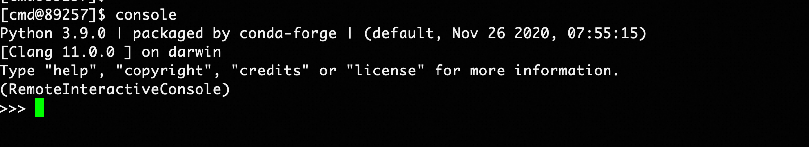


## Memory Analysis: mem
### Memory Summary
The `summary` command can statistically analyze memory usage by variable type:

```shell
mem summary
```

```shell
mem summary --limit 100 --order descending
```

Where the `limit` parameter controls the number of TOP items displayed, and `order` controls sorting in descending or ascending order (descending/ascending).

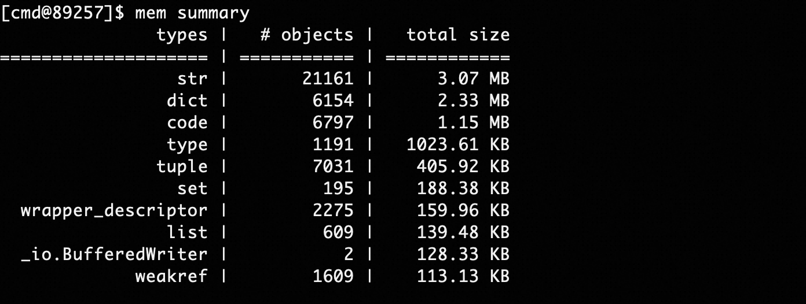

### Memory Diff
This command can compare memory size differences between two time points:

```shell
mem diff --interval 10 --limit 100 --order descending
```

As shown in the above command, take memory snapshots before and after 10s, compare differences, and display memory variable types with the largest differences in descending order, as shown below:

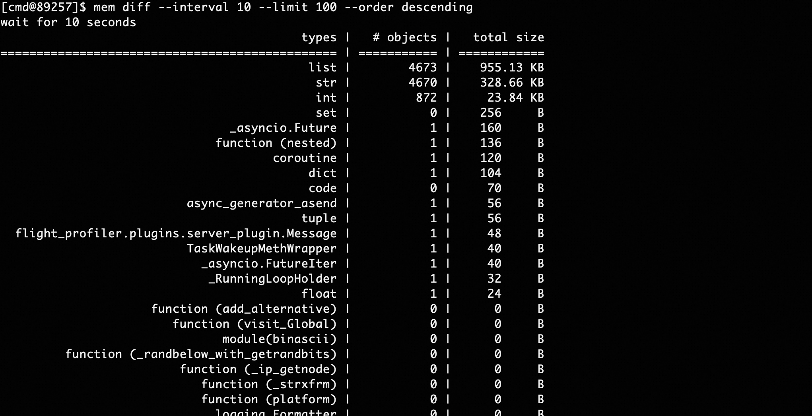

## GIL Lock Performance Analysis
### GIL Lock Loss Statistics
```shell
gilstat on
```

After executing the `gilstat on` command, the console will output GIL lock loss statistics for each thread every 5 seconds.

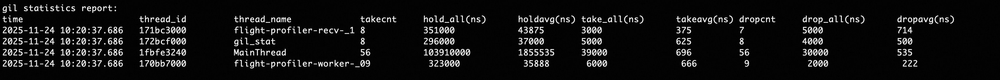

Output information fields include:

+ thread_name: Thread name
+ takecnt: Cumulative number of times GIL lock was acquired
+ hold_all: Cumulative time holding GIL lock, in nanoseconds, 1ms = 1000000ns
+ holdavg: Average time holding GIL lock after successfully acquiring it each time. When holding the GIL lock, other threads will pause execution, which can cause P99 to increase. <font style="color:#DF2A3F;">Performance optimization tip: This value can reflect whether the thread is computationally overloaded, and you might consider reducing continuous CPU computation time and appropriately yielding time slices to other threads</font>.
+ take_all: Cumulative wait time for acquiring GIL lock, as only one thread can acquire the GIL lock, other threads need to wait when taking the GIL lock. This can be understood as the time threads are blocked waiting for a mutex lock.
+ takeavg: Average wait time for acquiring GIL lock
+ drogcnt: Cumulative number of times GIL lock was released, usually equal to takecnt
+ drog_all: Cumulative time consumed releasing GIL lock, usually very small
+ dropavg: Average wait time for releasing GIL lock

### GIL Long Tail Loss Monitoring
```shell
gilstat on 5 5
```

The first parameter 5 represents the GIL lock acquisition time threshold of 5ms and the GIL lock holding time threshold of 5ms. That is, when a thread's GIL lock acquisition blocking exceeds 5ms, or a thread's GIL lock holding time exceeds 5ms, a monitoring message will be printed. This command can analyze some long-tail timeout queries in production.

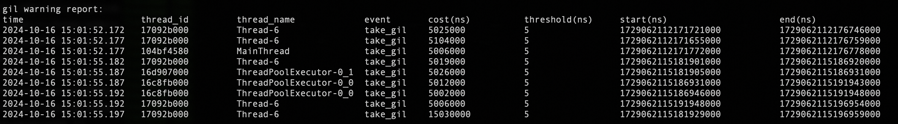

## PyTorch Framework Sampling
### Sampling Function Execution: profile
Implemented based on Torch Profiler, able to sample time consumption of execution functions in the torch framework, and execution on CPU or GPU.

Command examples:

```shell
torch profile module [class] method [-f <value>]
```

#### Parameter Analysis
| Parameter | Required | Meaning | Example |
| --- | --- | --- | --- |
| module | Yes | Module where the method is located | __main__, my.pkg.modulename |
| class | No | Class name where the method is located | className |
| method | Yes | Method name to observe | methodName |
| -nm, --nested-method | No       | Whether capture nested method with depth restrict to 1                                                                                                                                                                                                                                                                                                                                                                                     | -nm nested_method             |
| -f --filepath <value> | No | File path to export sampling files to, defaults to trace.json in current directory | -f ~/trace.json |

#### Output Display
Command examples:

```shell
# Sample the hello method of class A in the __main__ module
torch profile __main__ A hello
```

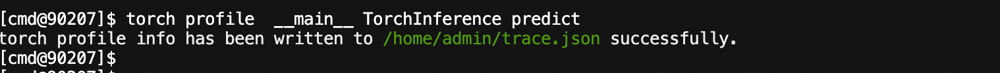

The generated trace.json file needs to be placed in the <font style="color:#DF2A3F;">chrome://tracing/</font><font style="color:rgb(0, 0, 0);"> path of the Chrome browser for visualization, as shown in the result below</font>

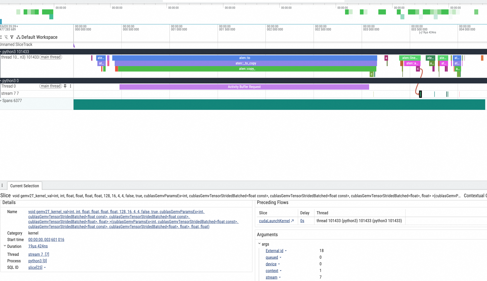

### torch Memory Snapshot
Implemented based on Torch Profiler, able to snapshot memory space used by the process, or record memory allocation behavior during method execution:

```shell
torch memory [-s] [-r module [class] method] [-f <value>]
```

#### Parameter Analysis
| Parameter | Required | Meaning | Example |
| --- | --- | --- | --- |
| -s, --snapshot | No | Whether to snapshot the memory space used by the current process | -s |
| -r, --record | No (choose one of -s, -r) | Whether to record torch framework memory allocation actions during method execution, module, class, method consistent with profile | -r module class |
| -nm, --nested-method | No       | Whether capture nested method with depth restrict to 1                                                                                                                                                                                                                                                                                                                                                                                     | -nm nested_method             |
| -f --filepath <value> | No | File path to export sampling files to, defaults to snapshot.pickle in current directory | -f ~/snapshot.pickle |

#### Output Display
Command examples:

```shell
# Snapshot the torch memory used by the current process
# Due to torch monitoring memory
torch memory -s

# Observe memory allocation actions during method execution
torch memory -r __main__ Solution call
```

The generated snapshot.pickle file needs to be analyzed in [https://pytorch.org/memory_viz](https://pytorch.org/memory_viz)<font style="color:rgb(0, 0, 0);">, as shown in the result below, where the left list shows the timing behavior of allocation and collection:</font>

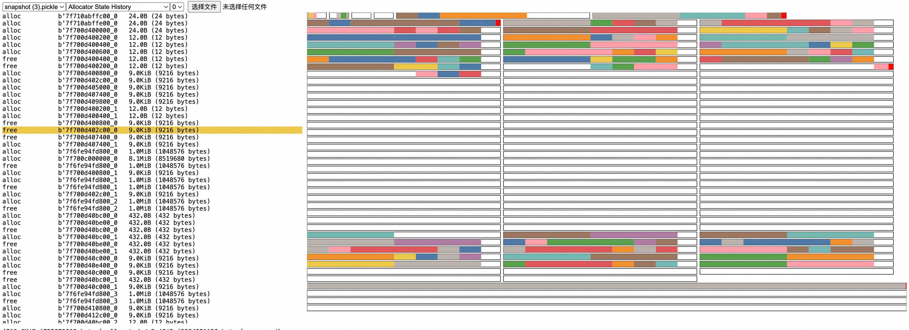

For specific principles/how to get effective information from the graph: [https://pytorch.org/docs/2.5/torch_cuda_memory.html](https://pytorch.org/docs/2.5/torch_cuda_memory.html)

<font style="color:#DF2A3F;">Note:</font>

Since sampling of historical memory allocation under the torch framework has not been enabled, <font style="color:#DF2A3F;">stack information cannot be traced for already allocated memory</font>. If you want to see allocation behavior from program startup (usually in <font style="color:#DF2A3F;">development environment</font>), you can use the following methods:

1. Delay major memory allocation to a method, then use record to record method execution
2. Add a small script before the program starts to indicate enabling sampling
   1. For 2.0.0 <= torch < 2.1.0 versions, add at program start, then use snapshot command to view
      ```python
      from torch.cuda.memory import _record_memory_history
      _record_memory_history(enabled=True, trace_alloc_max_entries=100_000, trace_alloc_record_context=True)
      ```

   2. For torch >= 2.1.0 versions, add at program start
      ```python
      from torch.cuda.memory import _record_memory_history
      _record_memory_history()
      ```
